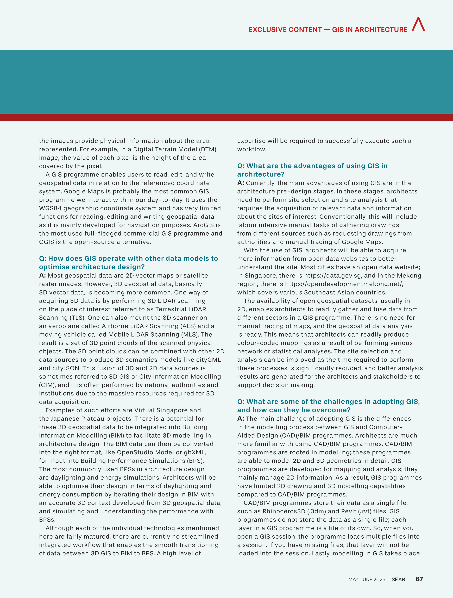
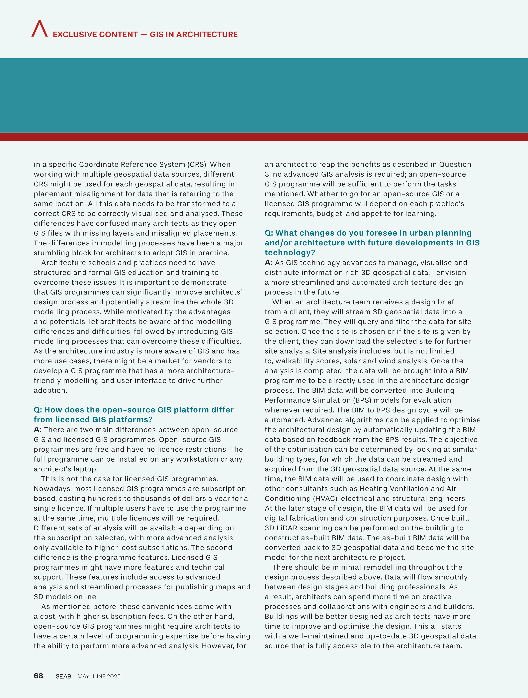

Title: Southeast Asia Building (SEAB) Magazine Inteview on the Use of GIS in Architectural Design
Summary: My interview with SEAB about the potential advantages of using GIS in architectural design.
Date: 2025-05-30
Authors: Kian Wee Chen
Status: published
Duration: 15 mins
Category: Essay

My interview with SEAB about the potential advantages of using GIS in architectural design. You can read the full issue <a href="https://dxfpracgmlczp.cloudfront.net/2025/05/1747122419585_SEAB%20MayJune%202025.pdf" target="_blank">here</a>.  

## Interview Extract from the May-June 2025 SEAB Magazine

I hope this post provides you some insights on the issue. What are your thoughts? <a href="https://www.linkedin.com/posts/kian-wee-chen-79b2b721_blog-activity-7334395064565039106-ixM9?utm_source=share&utm_medium=member_desktop&rcm=ACoAAAR-VqcBI2WVhLSf-dcz1wsslwv9rVp1vYE" target="_blank">Let’s continue the conversation in the comments</a>!

## Resource
- <a href="https://chenkianwee.github.io/gis4design" target="_blank">GIS4Design user manual</a>
