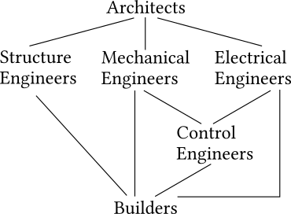
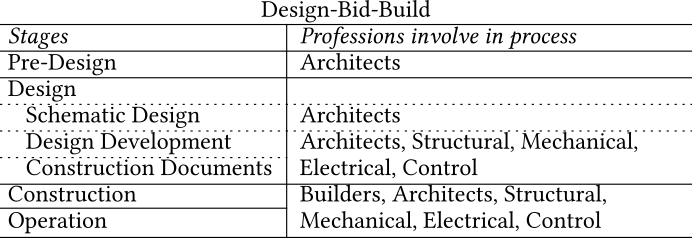
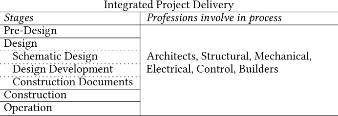

Title: Architectural Design is the Start of the Building Design Process
Summary: As architectural design usually serves as the basis for other engineering domain designs, an architectural design that has meaningfully considered and accomodated for engineering performances will significantly facilitate the realization of high-performance buildings and zero-energy buildings.
Date: 2025-09-02
Authors: Kian Wee Chen
Status: published
Duration: 3 mins
Category: Essay

As architectural design usually serves as the basis for other engineering domain designs, an architectural design that has meaningfully considered and accomodated for engineering performances will significantly facilitate the realization of high-performance buildings and zero-energy buildings. 

## Building Design Process
Due to the nature of AECO industry, the design process for each building project is unique depending on where it is located. As each location will have its own unique site conditions, climate, building codes and construction practices. Although unique, the process generally shares similarities. The design process can be divided into four main stages: pre-design, design, construction and operation stages. Depending on the type of contract chosen for the project (Integrated Project Delivery, Design-Bid-Build or Design Build etc.), different building professionals will get involve at different stages of the design process. 

The design process when reduced to its basics follow these steps (as shown in the diagram below): architects produce architectural designs, based on the architectural design, structural engineers will develop the structural design,  mechanical engineers will develop the Heating Ventilation and Air-Conditioning (HVAC) design, and electrical engineers will develop the electrical design. Control engineers will develop building controls based on the HVAC and electrical designs. The final drawings/models are consolidated for the builders to do cost estimation and construction. This is an iterative process, feedback will be provided to improve on the architectural and engineering designs and the design process repeats. Post construction, there will be a comissioning phase for each domain expert to verify the building is constructed and function as specified by the drawings before the it is allowed to be handed over to the facilities and be occupied by its users. 

The professions involve and their importance in the design process will differ depending on the scale and building type. For example, packaged HVAC systems are usually used in residential projects, the mechanical engineers role will be less important. Control engineers will not be necessary as the building systems are relatively simple and does not need much automation or controls. However, in a high-rise office building, mechanical engineers will play a more important role as built-up HVAC system will be used. Controls will be essential as automation and central control will be needed for efficient management of building systems in such a big building. Circulation specialists will be required as vertical circulation (elevators) is a major building systems in high-rise office buildings.

The difference between a conventional design-bid-build from an integrated project delivery is that this full design cycle happens in the the later design stages, while in an integrated project delivery this full design cycle happens from the early stages throughout the design process. 
- In the design-bid-build project all the professions that is required to complete the design cycle are present only at the construction stage. 
- In integrated project delivery, you include as many professions possible right from the start of the building project. 

## Architectural Design: A Good Beginning is Half the Battle
As you can see from the described design process, architects usually kick-starts the design process by giving form to the building. The structural, mechanical, electrical and control engineers develop their design based on the underlying architectectural design. As mentioned above, this is an iterative process. If we get it right from the start (architectural design) we can reduce the number of iterations and reach the target earlier. In my previous post (<a href="02_bps.html" target="_blank">Domain Expertise, Models and Simulation Programs: How to Use Building Performance Simulation in Architectural Design</a>) I have briefly described the need for architects to improve their engineering knowledge and how we can use Building Performance Simulation (BPS) to facilitate architectural engineering education. I hope this post will make a stronger case that since architectural design is usually the start of a building design process, it is essential architects improve their engineering knowledge. If architects can meaninfully consider and accomodate for high performance building systems in their design, it will make constructing a high performance building or even Zero Energy Building (ZEB) more achievable.   

I hope this post provides you some insights on the issue. What are your thoughts? <a href="https://www.linkedin.com/posts/kian-wee-chen-79b2b721_architecturaldesign-buildingdesign-highperformancebuilding-activity-7368850276138512384-k5nc?utm_source=share&utm_medium=member_desktop&rcm=ACoAAAR-VqcBI2WVhLSf-dcz1wsslwv9rVp1vYE" target="_blank">Let’s continue the conversation in the comments</a>!

# Resource
- *Chen, K.W.*, Janssen, P., Aviv, D., Ninsalam, Y., Meggers, F., (2022). ***A Framework for Considering the Use of Computational Design Technologies in the Built Environment Design Process***. ITcon 27, 1010–1027. <a href="https://doi.org/10.36680/j.itcon.2022.049" target="_blank">[DOI]</a>

