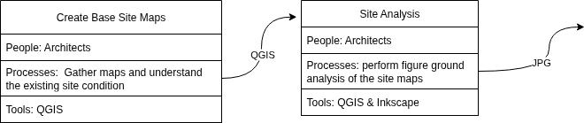
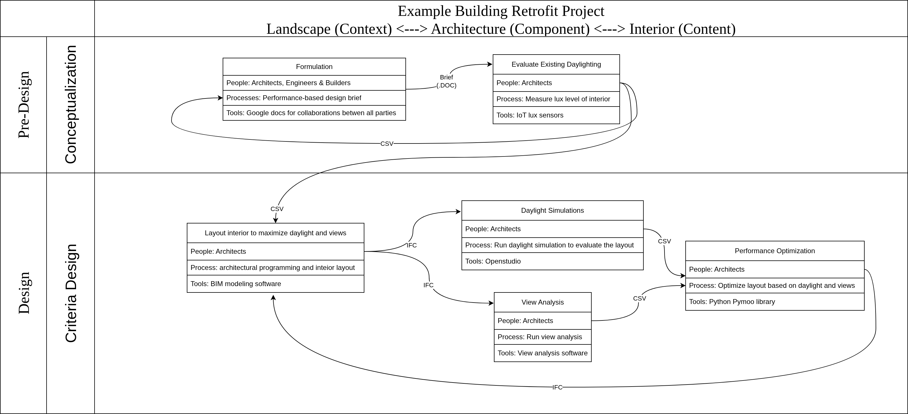

Title: A Framework to Understand Building Design Process for Computational Design Research
Summary: The framework provides a practical overview of the design process of a building project by placing it in context within the built environment and outlining its key stages, participants and tasks.
Date: 2025-12-01
Authors: Kian Wee Chen
Status: published
Duration: 10 mins
Category: Essay

The framework provides a practical overview of the design process of a building project by placing it in context within the built environment and outlining its key stages, participants and tasks.

## Motivation
The building design process is often times long and messy with many participants. It has always been a challenge for me to describe the building design processes and how my computational design research can improve and optimize the process. I have come up with a framework that provides a practical overview of the design processes to help me think about the subject. The framework is a consolidation of other frameworks I have came across throughout my research career. It has been helpful for me and I hope it can be helpful for you too.

## Situating Building Design Project within Our Built Environment
Before diving into the building design process, I think it is worth to understand where a building design is situated within the bigger context, our built environment. A simple framework of our built environment based on 6 scales is presented here to facilitate the understanding.

- Products - products such as graphic design, furniture, laptops.
- Interiors - space within a structure.
- Structures - external form constructed from products that contained interior spaces.
- Landscapes/Urban Designs - planned outdoor spaces.
- Cities - structures and urban areas clustered together defining a community.
- Regions - cities and landscapes group together due to common social, political and economical characteristics.

A building design project falls into the structures category. There is a **content <-> component <-> context** relationship between the categories. 

In designing a **building (structure)**, you will need to be aware of the **content in the building (interior) and where the building is situated, the context of the building (landscape)**. It provides a framework for the things to consider when approaching a design project. Now that we have a sense of where building design is within the bigger built environment context, let's dive into describing the building design project.

## Work Stages of a Building Design Project 
Generally, a design project can be separated into 4 main work stages.

- Pre-design - conceptualize the design brief e.g. site selection, specifications etc.
- Design - propose design solutions.
- Construction - design and build the chosen solution.
- Operation - operate and maintain the built artefact.

A fifth stage **Demolition** could be added to it, however it is not common practice yet for designers to consider demolition during design.

### Professions 
Depending on the type of contract (Integrated Project Delivery, Design-Bid-Build or Design Build etc.) chosen for the project, different building professionals will participate at different stages of the design process. For example, in the more traditional Design-Bid-Build contract, engineering consultants will join the design process in the later stages while in the Integrated Project Delivery contract, ideally engineering consultants join in much earlier in the design process. For more information refer to my previous post (<a href="05_bldg_dgn.html" target="_blank">Architectural Design is the Start of the Building Design Process</a>).

## Design Tasks 
Within each stage, there will be a set of deliverables. **The deliverables can be drawings, 3D models, analysis or mock-ups**. Design tasks are performed to produce the deliverables. Design task can be defined as a node with inputs and outputs, depending on the task at hand it might or might not need inputs (existing data/information), but it definitely has an output that is the deliverable. It is also defined by other attributes like the professions who are performing the tasks, processes and tools involved in producing the deliverables. A design stage is made up of a network of design task nodes feeding into each other with the aim of producing deliverables to hit the contractual milestones of the design stage.

# Case Study: Example Building Retrofit Project
In this section I illustrate the first two design stages (conceptualization and criteria design) of an example building retrofit project using the described framework. The primary driver of the project is to improve the daylighting performance of the existing interior layout. By illustrating the design processes with the framework, we can readily see the computational design tools that can support the performance objectives. IoT lighting lux sensors to understand the existing daylighting levels and daylighting simulations to evaluate potential design options that can improve the current performances. We can also see the connections between the design tasks across the different design stages (right-click -> Open image in new tab for a bigger image).

# Conclusion
I have described a framework that helps computational design researchers think about how their work can support a building design project. I did a quick and simple demonstration of the framework on an example project. The exercise of illustrating the design process with the framework has been very helpful for me in thinking about how my work can support design work in practice, I hope it will be useful for you too.

<a href="https://www.linkedin.com/posts/kian-wee-chen-79b2b721_some-of-my-thoughts-on-the-core-of-design-activity-7405671363300040704-HIQk?utm_source=share&utm_medium=member_desktop&rcm=ACoAAAR-VqcBI2WVhLSf-dcz1wsslwv9rVp1vYE" target="_blank">Let’s continue the conversation in the comments</a>!

# References
- Mcclure, W.R., Bartuska, T.J. (Eds.), 2007. The Built Environment: A Collaborative Inquiry into Design and Planning, 2nd ed. John Wiley & Sons Inc., New Jersey, USA.
- Lawson, B., 2019. The Design Student’s Journey: Understanding How Designers Think. Routledge, Oxon, England.
- Chen, K.W., Janssen, P., Aviv, D., Ninsalam, Y., Meggers, F., 2022. A framework for considering the use of computational design technologies in the built environment design process. ITcon 27, 1010–1027. https://doi.org/10.36680/j.itcon.2022.049