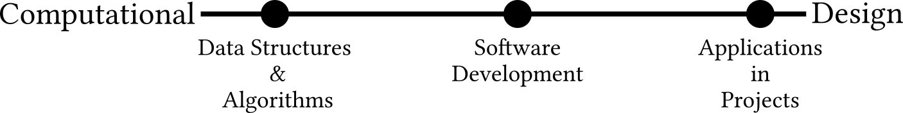
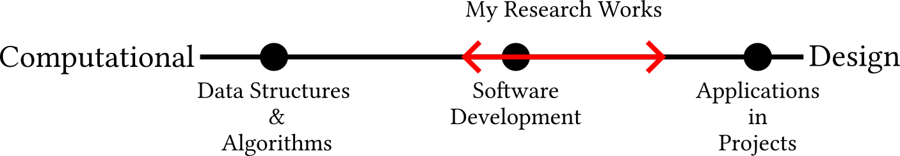

Title: Computational Design Research
Summary: Computational design is the study of using computer programming to solve architecture/engineering design problems.
Date: 2026-01-15
Authors: Kian Wee Chen
Status: published
Duration: 5 mins
Category: Essay

Computational design is the study of using computer programming to solve architecture/engineering design problems.

## Introduction
Computational designers are architect/engineers who can do computer programming. They have domain expertise while possessing the computer skills to develop new workflows to support efficient project delivery. Thus a **practical and easy to remember definition of computational design is the study of using computer programming to solve engineering/architecture design probems.** Programming (including both textual codes like Python & Javascript, and visual programming like Grasshopper & Dynamo) provides designers full access to computation capabilites as compared to the limited access provided by Graphic User Interface (GUI). In my opinion, this is the main difference between computational design and Computer-Aided Design (CAD), where in the CAD field, designers are primarily reliant on the software GUIs.

## Motivation
As Architecture, Engineering, Construction & Operation (AECO) industry continues to digitalize through digital transformation effort globally, it is increasingly common for practices to have computational designers on their team. As computational design plays a bigger role in AECO projects, it is useful to look at how we can improve and grow the field through research work.

## Research in Computational Design

Research in computational design occurs on a spectrum as shown above. On the one end, we have computational leaning research and on the other design leaning research. Generally, there are three anchor points on the spectrum: Data structures and algorithms, software development and applications in projects. It is important to note that most research do not cleanly fall into either category but rather is a mix depending on where it lies on this spectrum.

- **Data structures and algorithms** are computational leaning research that investigates:
    1. data structures or schemas for computation work in the AECO field
    2. develops or improves algorithms that efficiently do computation on these data structures
    - examples are researchers looking at data schemas like 
        - <a href="https://github.com/buildingSMART/IFC5-development" target="_blank">Industry Foundation Class (IFC)</a> for Building Information Modeling (BIM), 
        - <a href="https://www.ogc.org/standards/citygml/" target="_blank">CityGML</a> and <a href="https://www.cityjson.org/" target="_blank">CityJSON</a> for City Information Modeling,
        - <a href="https://openstudio.net/" target="_blank">OpenStudioSDK</a> for building energy simulation,
        - <a href="https://brickschema.org/" target="_blank">Brick Schema</a> for building operations
- **Software development** are research in the middle of the spectrum where it applies the results from the data structures and algorithm research and use it to develop software and programming libraries for used in projects. Examples include:
    - <a href="https://ifcopenshell.org/" target="_blank">ifcopenshell</a> a programming library for processing IFC data,
    - <a href="https://www.grasshopper3d.com/profiles/blogs/evolutionary-principles" target="_blank">Galapagos</a> and <a href="https://www.wallacei.com/research" target="_blank">Wallacei</a> are Rhino Grasshopper 3D plugins for executing optimization algorithm in design
- **Applications in projects** are research that focuses on the use of these software tools in case studies. They share insights into the benefits and challenges of using these new technologies in design. 
    - <a href="https://www.tandfonline.com/doi/full/10.1080/09613218.2023.2256433" target="_blank">Generative design of terraced concert hall – a case study of Taipei music and library centre</a>
    - <a href="https://www.itcon.org/paper/2018/8" target="_blank">Design space construction: a framework to support collaborative, parametric decision making</a>

Alot of my research works fall around **software development** and **applications in projects** while slightly leaning towards **software development**. Most of my applications are demonstration cases with only a couple of projects that were actually built.

# Conclusion
I have described a **Computational <-.--.--.-> Design** research spectrum with 3 anchor points and gave examples of research work that falls on the anchor points. A computational design researcher work will probably cover a range rather than only occupying a discrete point on the spectrum, as I have illustrated with my own works. Combining this framework with the <a href="06_dgn_process.html" target="_blank">Building Design Process framework from my previous post</a>, it will provide researchers with an insight of where their works stand relative to the field and how it can eventually be use in practice. For practice this will give them a big picture of how research can support and improve their design process. I hope the 2 frameworks can be use to create a feedback loop between research and practice and accelerate innovations in the AECO industry.

<a href="https://www.linkedin.com/posts/kian-wee-chen-79b2b721_some-of-my-thoughts-on-computational-design-activity-7417782261590310912-bB5t?utm_source=share&utm_medium=member_desktop&rcm=ACoAAAR-VqcBI2WVhLSf-dcz1wsslwv9rVp1vYE" target="_blank">Let’s continue the conversation in the comments</a>!